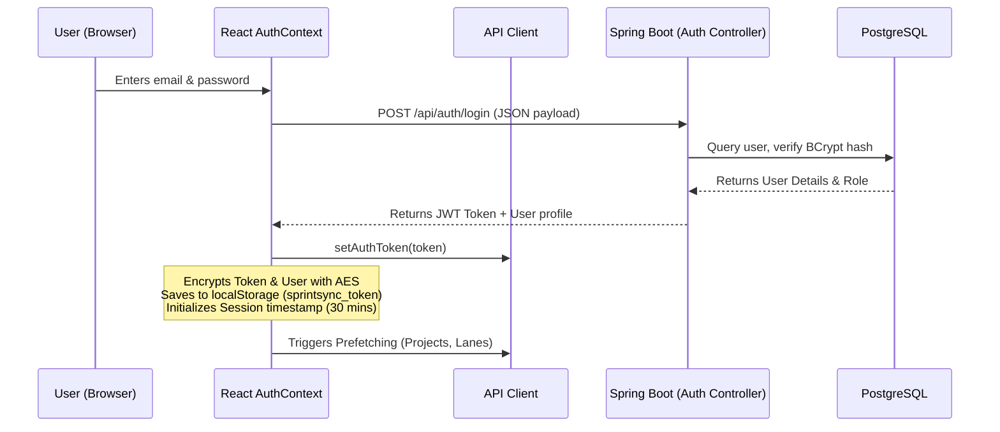

# SprintSync - Application Logic & Architecture Reference

This document maps out the core application logic, system state lifecycle, data pipelines, and architectural patterns of the **SprintSync** application. Use this document to understand how components link together and how data propagates across the stack.

---

## 1. Authentication, Encryption & Session Lifecycle

SprintSync implements secure, role-restricted, and activity-tracked sessions.



### Encryption & Storage (`encryptionUtils.ts`)
*   To prevent unauthorized local inspection, the frontend uses AES encryption (via `crypto-js`) combined with a signing key (`SprintSync_Secure_Auth_Key_2026_@!!`) to encrypt the JWT token and user details stored in `localStorage`.
*   The token itself is used as the key for encrypting the user data profile (`sprintsync_user`), creating a dependent encryption chain.

### Active Session Tracking & Expiry
*   **Inactivity Check**: Every 60 seconds, a background interval computes the elapsed time since `sprintsync_session_timestamp`. If it exceeds 30 minutes, it automatically log outs the user.
*   **User Interactions**: Window events (keyboard keydown, mouse movement, mouse clicks, scroll, and touch) refresh the timestamp to keep active sessions alive.
*   **Visibility Changes**: If the user leaves the tab (tab blur), the timestamp is frozen to reflect active session timing. When returning (tab focus), if the session hasn't expired yet, it resets the timer.

---

## 2. State Management, Caching & Performance Optimizations

SprintSync uses hybrid client-side and server-side caching to maintain responsiveness.

### Client-Side In-Memory Cache (`client.ts`)
*   **Cache Map (`apiClient.cache`)**: Stores successful `GET` responses keyed by `METHOD:URL?QUERY` with a Default TTL of 10 seconds.
*   **Request De-duplication (`apiClient.inflightRequests`)**: If an identical HTTP request is already in flight, subsequent calls subscribe to the existing promise instead of firing duplicate HTTP fetches.
*   **Cache Invalidation**: Any mutation method (`POST`, `PUT`, `PATCH`, `DELETE`) automatically calls `clearCache()`, clearing all cached queries to ensure data freshness.

### Server-Side Caching (Caffeine Cache)
*   The backend enables **Caffeine Cache** in `ProjectCacheConfig.java` to cache JPA repository collections:
    ```properties
    spring.cache.type=caffeine
    spring.cache.cache-names=projects,projects-summary,users,departments,domains,epics,releases,stories,tasks
    spring.cache.caffeine.spec=maximumSize=1000,expireAfterWrite=30m
    ```
*   This protects the PostgreSQL database from repeated structural queries.

---

## 3. Data Pipelines & Key Feature Logic

### A. Scrum Board Board Drag-and-Drop Workflow (`ScrumPage.tsx`)
1. **UI Interaction**: User drags a story or task card to another column (e.g., `TO_DO` to `IN_PROGRESS`). The board uses `react-dnd` to track the drop target.
2. **Optimistic Updates**: The board visually updates the card position instantly.
3. **Database Write**: Fire a PATCH request `PATCH /api/tasks/{id}` containing the new status and order index.
4. **Lane Configurations**: The columns on the board are dynamic. The frontend queries `useWorkflowLanes` to map active columns:
    *   Default columns: `TO_DO`, `IN_PROGRESS`, `QA_REVIEW`, `DONE`, `BLOCKED`, `CANCELLED`.
    *   Managers can reorder lanes, rename them, or toggle their visibility using `LaneConfigurationModal.tsx`, which writes configurations back to `/api/scrum-boards`.

### B. Time Tracking & Rolling Hours Rollup Trigger
*   Every time log input in the frontend sends a `TimeEntry` payload to `/api/time-entries`.
*   **Rollup Database Trigger**: The database is configured with a PostgreSQL trigger (`create_time_entry_rollup_trigger.sql`) that captures changes to `time_entries` and automatically rolls up the sum of hours worked into the parent tasks, stories, and projects:
    *   `time_entries` -> updates `subtasks.actual_hours`
    *   `subtasks` -> updates `tasks.actual_hours`
    *   `tasks` -> updates `stories.actual_hours`
    *   `stories` -> updates `projects.spent` (budget vs spent comparison)

### C. Chat Section & Real-time Logs
*   Tasks and issues contain a `ChatSection.tsx` component allowing team discussion.
*   Messages are logged to the backend via `POST /api/chat-messages` and parsed in chronological order.
*   Security actions (e.g., changes to task priority, login events) trigger entries in `activityLogApi.ts` which capture `oldValues` vs `newValues` alongside IP address audits.

---

## 4. Key Algorithms

### Resource Allocation & Capacity Calculator (`TeamCapacityCalculator.tsx`)
*   **Capacity Matrix**: Computes individual capacity:
    $$\text{Capacity (Hours)} = \text{Sprint Duration (Days)} \times 8\text{ hrs} \times \left(\frac{\text{Availability \%}}{100}\right)$$
*   **Spent Effort Ratio**: Aggregates logged time entries against allocating limits to show burn charts.

### Burndown Analytics (`BurndownChart.tsx`)
*   Uses **Recharts** to plot a line representing:
    1. **Ideal Burn**: A straight line descending from Total Story Points to 0 over the sprint duration.
    2. **Actual Burn**: A descending line representing the sum of remaining uncompleted task story points calculated daily.

---

## 5. Security & Access Control Matrix (RBAC)

The application enforces permissions on both the client (UI elements and routes) and server (REST controllers).

*   **Role Hierarchy**: Admin and Master Admin roles bypass specific entity boundaries.
*   **Client Access Limits**: Clients are strictly routed to the `/reports` landing page and can only read reports or details for projects they are explicitly assigned to.
*   **Role Switcher**: Administrators can switch their active view role (via `RoleSwitcherContext.tsx`) to developer or manager mode to test UI presentation.
