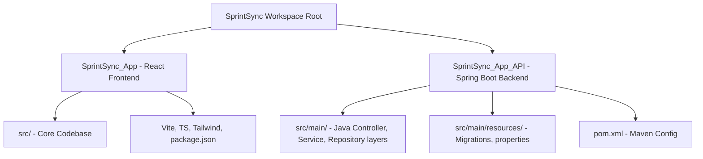

# SprintSync - Project Structure & Metadata Reference

This document provides a comprehensive overview of the **SprintSync** project structure, including folder organizations, key files, technologies, and configuration details for both the Frontend and Backend applications.

---

## 1. High-Level Project Directory Mapping

The codebase is split into two primary components:
1. **Frontend Application (`SprintSync_App`)**: A Vite-powered React single page application (SPA).
2. **Backend Application (`SprintSync_App_API`)**: A Java-based Spring Boot REST API application.



---

## 2. Frontend Project Structure (`SprintSync_App`)

The frontend application uses **Vite** with **React**, **TypeScript**, and **Tailwind CSS**. It is organized into a modular design system using Shadcn UI components.

### Directory Structure & Responsibilities

| Directory | Purpose / Role |
| :--- | :--- |
| **`src/assets/`** | Contains visual assets, images, logos (e.g., `ss_logo.gif`, `ChatGPT Image May 11, 2026, 10_10_51 AM.png`). |
| **`src/components/`** | Core UI components of the application. |
| **`src/components/ui/`** | Reusable atomic design components styled using Tailwind CSS and Radix UI (Shadcn/UI primitives). |
| **`src/contexts/`** | React Context Providers for global state management (Authentication, Routing/Navigation, Filters, Roles). |
| **`src/data/`** | Static data and offline datasets. |
| **`src/database/`** | Relational schemas, local database templates, and SQL scripts. |
| **`src/hooks/`** | Custom React hooks. Includes `src/hooks/api/` which wraps HTTP requests in react-query style cacheable hooks. |
| **`src/pages/`** | Component pages representing top-level application routes. |
| **`src/services/`** | Service files, specifically `api/` encapsulating HTTP clients, API configurations, and entities. |
| **`src/types/`** | TypeScript interfaces mapping API payloads, entities, statuses, and UI states (`types/api.ts`). |
| **`src/utils/`** | Helper modules, math calculators, date parsers, and custom games/features. |

### Core Frontend Files to Know

*   **[`App.tsx`](file:///c:/Users/snakhate/Music/SprintSync_App/SprintSync_App/src/App.tsx)**: Main entry point for routing, protected routes handling, sidebar layouts, and global prefetch setups.
*   **[`main.tsx`](file:///c:/Users/snakhate/Music/SprintSync_App/SprintSync_App/src/main.tsx)**: React root rendering with Providers initialization.
*   **[`package.json`](file:///c:/Users/snakhate/Music/SprintSync_App/SprintSync_App/package.json)**: Configures dependencies like React 18, Vite 6, Recharts, React Router, Radix/Shadcn primitives, and Lucide icons.
*   **[`vite.config.ts`](file:///c:/Users/snakhate/Music/SprintSync_App/SprintSync_App/vite.config.ts)**: Configures module aliasing (`@`), vendor chunk splitting, esbuild warning overrides, and the local dev port (defaults to `3000`).
*   **[`tsconfig.json`](file:///c:/Users/snakhate/Music/SprintSync_App/SprintSync_App/tsconfig.json)**: TypeScript compiler options, path mapping, and types declarations.

---

## 3. Backend Project Structure (`SprintSync_App_API`)

The backend is built with **Spring Boot 3.x** and **Java 17**, utilizing **Maven** for dependencies, **Spring Data JPA** for data persistence, **Spring Security (JWT)** for access controls, and **Flyway** for database migrations.

### Package Structure (`com.sprintsync.api`)

The backend structure adheres strictly to the classic layered architectural pattern:

```
com.sprintsync.api/
├── SprintSyncApiApplication.java   # Main Spring Boot Entrypoint
├── ServletInitializer.java         # WAR deployment configuration
├── config/                         # Security configuration, CORS, caching (Caffeine), JPA auditing
├── controller/                     # REST Controllers exposing HTTP endpoints (mapping to /api/*)
├── dto/                            # Data Transfer Objects mapping requests and responses
├── entity/                         # JPA Entities representing database schemas
├── repository/                     # Spring Data JPA Repository Interfaces (Database access)
├── security/                       # JWT filter, UserDetailsService, Auth tokens parser
├── service/                        # Service Interfaces & Implementations (Core Business Logic)
└── util/                           # Utilities (Encryption, Date converters, Validation)
```

### Core Configuration Files

*   **[`pom.xml`](file:///c:/Users/snakhate/Music/SprintSync_App/SprintSync_App_API/pom.xml)**: Maven project descriptor defining dependencies (Spring Boot starter web, JPA, Security, PostgreSQL driver, Flyway, Caffeine, Lombok).
*   **[`application.properties`](file:///c:/Users/snakhate/Music/SprintSync_App/SprintSync_App_API/src/main/resources/application.properties)**: Global configurations:
    *   **DB Connection**: Exposes PostgreSQL URLs (pointing to Aiven / remote databases on `192.168.0.236` with schema `sprintsync`).
    *   **HikariCP**: Max pool size `10`, validation timeout `10s`, connection timeout `90s`.
    *   **Caching**: Enables Caffeine cache for JPA entities (`expireAfterWrite=30m`).
    *   **Flyway**: Enabled on schema `sprintsync`.
    *   **Actuator**: Enables health and info checks on endpoints.
    *   **CORS**: Predefined allowed origins (`localhost:3000`, `localhost:5173`, production instances).

---

## 4. Database Schema & Migrations

The database contains tables representing the core modules of agile planning (Projects, Sprints, Epics, Releases, Stories, Tasks, Subtasks, Time Entries, Chat Messages, Attachments, Notifications, Activity Logs).

*   **Backend Flyway location**: `SprintSync_App_API/src/main/resources/db/migration`
*   **Frontend SQL references**: `SprintSync_App/database/migrations` and `SprintSync_App/create-tables.sql`

Key tables and fields defined in database schema:
*   `users`: Core user accounts (roles include: `ADMIN`, `MANAGER`, `DEVELOPER`, `QA_MANAGER`, `QA_DEVELOPER`, `MASTER_ADMIN`, `SUPPORT_AND_IMPLEMENTATION`, `CLIENT`). Contains details like CTC, designation, experience, and joining dates.
*   `projects`: Managed agile/waterfall projects with priorities, budget, managers, and scope.
*   `sprints`: Sprint buckets containing planned tasks, dates, capacity hours, and velocity targets.
*   `stories`: Agile user stories linking tasks to sprints and epics. Includes `due_date` and `actual_hours`.
*   `tasks` & `issues`: Main deliverables and bugs containing status lanes (`TO_DO`, `IN_PROGRESS`, `QA_REVIEW`, `DONE`, `BLOCKED`, `CANCELLED`).
*   `subtasks`: Finer task allocations.
*   `time_entries`: Logged work hours matching types (`development`, `testing`, `review`, `bug_fix`, etc.).
*   `workflow_lanes`: Customizable lanes for Scrum boards.
*   `login_activity_logs`: Auditing for login attempts, IP addresses, and user-agents.
